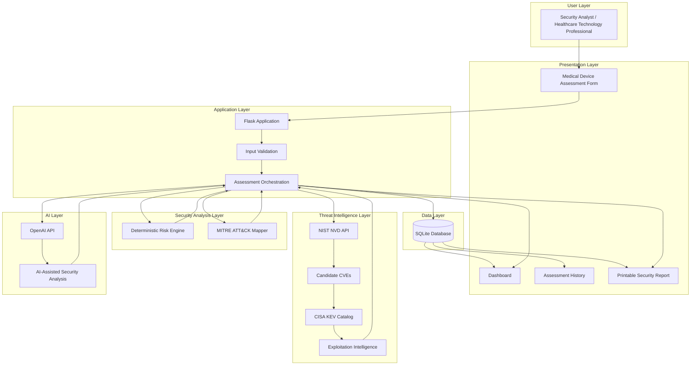

<div align="center">

# 🏥 HealthGuard AI

### AI-Powered Medical Device Cybersecurity Risk Assessment Platform

**Deterministic Risk Scoring · Vulnerability Intelligence · Threat Prioritization · MITRE ATT&CK · Generative AI**

<br>


<br>

**Healthcare Cybersecurity · Medical Device Security · Threat Intelligence · AI-Assisted Risk Analysis**

</div>

---

## Overview

**HealthGuard AI** is an AI-assisted cybersecurity decision-support platform designed to help healthcare technology professionals assess the security posture of network-connected medical devices and healthcare technology assets.

The platform combines a **deterministic Python risk-scoring engine** with vulnerability intelligence, known-exploitation data, MITRE ATT&CK technique mapping, and Generative AI.

Instead of allowing AI to determine the security score, HealthGuard AI separates deterministic cybersecurity logic from AI-generated explanation.

```text
Security Controls
       ↓
Deterministic Risk Score
       ↓
Vulnerability Intelligence
       ↓
Known Exploitation Analysis
       ↓
MITRE ATT&CK Mapping
       ↓
AI-Assisted Security Analysis
```

> [!IMPORTANT]
> HealthGuard AI is an educational prototype developed for academic, research, and portfolio purposes. It is not a vulnerability scanner, penetration-testing platform, regulatory audit tool, clinical safety system, or HIPAA compliance certification platform.

---

# Core Capabilities

| Capability | Description |
|---|---|
| **Medical Device Risk Assessment** | Evaluates technical and operational security conditions |
| **Deterministic Risk Engine** | Calculates reproducible risk scores without AI involvement |
| **NVD CVE Intelligence** | Retrieves CVE candidates from the National Vulnerability Database |
| **CISA KEV Intelligence** | Identifies vulnerabilities with confirmed exploitation evidence |
| **Ransomware Context** | Displays known ransomware campaign usage from KEV |
| **MITRE ATT&CK Mapping** | Maps identified exposure conditions to adversary techniques |
| **AI-Assisted Analysis** | Generates structured explanations and remediation recommendations |
| **Assessment History** | Stores previous assessments using SQLite |
| **Printable Reports** | Produces browser-printable cybersecurity assessment reports |
| **Automated Testing** | Validates core functionality using Pytest |

---

# Risk Assessment

HealthGuard AI evaluates security conditions including:

<table>
<tr>
<td width="50%">

### Device & Lifecycle

- Device type
- Manufacturer
- Model
- Operating system
- Support status
- End-of-life status
- Patch management
- Endpoint protection

</td>
<td width="50%">

### Access & Network Security

- Network connectivity
- Internet exposure
- Wireless connectivity
- Vendor remote access
- Multifactor authentication
- Network segmentation
- Unique user accounts
- Default credentials

</td>
</tr>

<tr>
<td width="50%">

### Data Protection

- Encryption in transit
- Encryption at rest
- Patient-data storage considerations

</td>
<td width="50%">

### Monitoring & Recovery

- Audit logging
- Backup availability
- Recovery capability
- Security maintenance processes

</td>
</tr>
</table>

---

# Deterministic Risk Engine

The numerical risk score is calculated entirely by Python-based security rules.

**Generative AI does not determine or modify the score.**

| Score | Classification |
|---:|:---|
| **0–24** | Low |
| **25–49** | Medium |
| **50–74** | High |
| **75–100** | Critical |

This design provides:

- Reproducibility
- Explainability
- Consistent scoring
- Separation between security logic and AI interpretation

> [!NOTE]
> The scoring methodology is educational and is not an official scoring system published by NIST, FDA, HHS, CISA, or another regulatory authority.

---

# NVD CVE Intelligence

HealthGuard AI integrates with the **NIST National Vulnerability Database** to retrieve potentially relevant CVEs.

Example search terms:

```text
Apache Log4j
Microsoft Windows 7
OpenSSL
VMware ESXi
Apache HTTP Server
```

For each candidate vulnerability, HealthGuard AI can display:

| Field | Example |
|---|---|
| CVE | `CVE-2021-44228` |
| CVSS | `10.0` |
| Severity | `CRITICAL` |
| Description | NVD vulnerability description |
| Vector | CVSS vector |
| Source | Direct NVD reference |

> [!WARNING]
> The current NVD implementation uses keyword-based searching. A returned CVE does **not** prove that a specific medical device, software version, or configuration is affected.

Results should therefore be interpreted as **CVE candidates requiring validation**.

---

# CISA Known Exploited Vulnerabilities

CVE candidates are automatically checked against the **CISA Known Exploited Vulnerabilities (KEV) Catalog**.

This provides an additional layer of threat prioritization beyond CVSS severity.

### Example

```text
CVE-2021-44228

CVSS                    10.0
Severity                CRITICAL
Known Exploited         YES
Ransomware Use          KNOWN
Vendor                  Apache
Product                 Log4j2
```

For KEV matches, HealthGuard AI can display:

- Vendor
- Product
- Vulnerability name
- Date added to KEV
- Required remediation action
- CISA due date
- Known ransomware campaign use
- CWE identifiers

### Why KEV Matters

```text
High CVSS
   ≠
Confirmed exploitation

High CVSS
   +
CISA KEV Match
   =
Higher operational priority
```

---

# MITRE ATT&CK Mapping

HealthGuard AI maps selected exposure conditions to potentially relevant MITRE ATT&CK techniques.

| Security Condition | Technique | ATT&CK ID |
|---|---|---|
| Default credentials | Default Accounts | `T1078.001` |
| Weak account controls | Valid Accounts | `T1078` |
| Vendor remote access | External Remote Services | `T1133` |
| Remote administration | Remote Services | `T1021` |
| Internet exposure | Exploit Public-Facing Application | `T1190` |

Each mapping includes:

- Technique ID
- Technique name
- ATT&CK tactic
- Explanation of relevance
- Direct MITRE reference

> [!CAUTION]
> MITRE mappings represent techniques that **could be relevant** to the identified security conditions. They do not indicate that an adversary, compromise, or attack was actually observed.

---

# AI-Assisted Security Analysis

After deterministic scoring and intelligence enrichment are completed, HealthGuard AI uses the OpenAI API to produce structured decision-support analysis.

The AI can generate:

```text
Executive Summary

Primary Cybersecurity Risks

Patient-Safety and Operational Considerations

HIPAA Security Considerations

Immediate Priority Actions

Long-Term Recommendations

Limitations and Assumptions
```

### AI Guardrails

The model is instructed not to:

- Modify the deterministic score
- Invent CVEs
- Invent affected versions
- Invent manufacturer claims
- Invent vulnerabilities
- Make unsupported regulatory findings
- Declare HIPAA compliance
- Make legal conclusions
- Invent clinical facts

The result is a hybrid architecture:

```text
Python = Decision Logic
AI     = Explanation
```

---

# System Architecture



# Technology Stack

| Layer | Technology |
|---|---|
| **Language** | Python |
| **Web Framework** | Flask |
| **Database** | SQLite |
| **AI** | OpenAI API |
| **Vulnerability Intelligence** | NIST NVD API |
| **Exploitation Intelligence** | CISA KEV |
| **Adversary Framework** | MITRE ATT&CK |
| **HTTP Client** | Requests |
| **Templates** | Jinja2 |
| **Frontend** | HTML5 / Bootstrap 5 / CSS |
| **Testing** | Pytest |
| **Version Control** | Git |
| **Repository** | GitHub |

---

# Security Intelligence Workflow

```text
┌─────────────────────────┐
│    Device Assessment    │
└────────────┬────────────┘
             │
             ▼
┌─────────────────────────┐
│ Deterministic Risk      │
│ Calculation             │
└────────────┬────────────┘
             │
             ├───────────────► MITRE ATT&CK Mapping
             │
             ▼
┌─────────────────────────┐
│ NVD CVE Search          │
└────────────┬────────────┘
             │
             ▼
┌─────────────────────────┐
│ Candidate CVEs          │
└────────────┬────────────┘
             │
             ▼
┌─────────────────────────┐
│ CISA KEV Enrichment     │
└────────────┬────────────┘
             │
             ▼
┌─────────────────────────┐
│ Exploitation Context    │
└────────────┬────────────┘
             │
             ▼
┌─────────────────────────┐
│ OpenAI Analysis         │
└────────────┬────────────┘
             │
             ▼
┌─────────────────────────┐
│ Security Report         │
└─────────────────────────┘
```

---

# Installation

<details>
<summary><strong>1. Clone the repository</strong></summary>

```bash
git clone https://github.com/MoncadaR/healthguard-ai.git
cd healthguard-ai
```

</details>

<details>
<summary><strong>2. Create a virtual environment</strong></summary>

### macOS / Linux

```bash
python3 -m venv venv
source venv/bin/activate
```

### Windows

```powershell
python -m venv venv
venv\Scripts\activate
```

</details>

<details>
<summary><strong>3. Install dependencies</strong></summary>

```bash
python -m pip install -r requirements.txt
```

</details>

<details>
<summary><strong>4. Configure environment variables</strong></summary>

Create:

```text
.env
```

Add:

```text
OPENAI_API_KEY=your_openai_api_key_here
OPENAI_MODEL=gpt-5-mini
FLASK_SECRET_KEY=replace_with_your_secret_key

NVD_API_KEY=
NVD_RESULTS_LIMIT=10
```

The NVD API key is optional.

Never commit the real `.env` file.

</details>

<details>
<summary><strong>5. Initialize the database</strong></summary>

```bash
flask --app app init-db
```

Expected:

```text
Database initialized successfully.
```

</details>

<details>
<summary><strong>6. Start HealthGuard AI</strong></summary>

```bash
flask --app app run --debug --port 5001
```

Open:

```text
http://127.0.0.1:5001
```

</details>

---

# Testing

Run the complete test suite:

```bash
python -m pytest -v
```

Tests cover:

```text
Risk Engine
    ├── Score calculation
    ├── Risk boundaries
    └── Security findings

Flask Application
    ├── Routes
    ├── Input validation
    └── Database behavior

Threat Intelligence
    ├── NVD parsing
    ├── CISA KEV matching
    └── MITRE ATT&CK mapping
```

---

# Project Structure

```text
healthguard-ai/
│
├── app.py
├── ai_service.py
├── database.py
├── risk_engine.py
│
├── nvd_service.py
├── kev_service.py
├── mitre_service.py
│
├── schema.sql
├── requirements.txt
├── README.md
├── .gitignore
│
├── static/
│   └── css/
│       └── style.css
│
├── templates/
│   ├── assessment.html
│   ├── base.html
│   ├── error.html
│   ├── history.html
│   ├── index.html
│   ├── report.html
│   └── result.html
│
└── tests/
    ├── test_app.py
    ├── test_risk_engine.py
    ├── test_nvd_service.py
    ├── test_kev_service.py
    └── test_mitre_service.py
```

---

# Example Analysis

```text
DEVICE
Legacy Medical Server

RISK SCORE
92 / 100

CLASSIFICATION
CRITICAL


VULNERABILITY INTELLIGENCE
CVE-2021-44228
CVSS 10.0
Critical


EXPLOITATION INTELLIGENCE
CISA KEV: YES
Known Ransomware Use: KNOWN


ATT&CK MAPPING
T1078.001   Default Accounts
T1078       Valid Accounts
T1133       External Remote Services
T1021       Remote Services
T1190       Exploit Public-Facing Application
```

---

# Current Capabilities

<table>
<tr>
<td>

**Risk Analysis**

- Medical-device assessments
- Deterministic scoring
- Low–Critical classification
- Security findings
- Control recommendations

</td>
<td>

**Threat Intelligence**

- NVD CVE lookup
- CVSS analysis
- CISA KEV matching
- Ransomware-use context
- CWE information

</td>
</tr>

<tr>
<td>

**Threat Modeling**

- MITRE ATT&CK mapping
- Technique explanations
- Tactic context
- Exposure mapping

</td>
<td>

**Reporting**

- AI-assisted analysis
- Assessment history
- SQLite persistence
- Printable reports
- Automated testing

</td>
</tr>
</table>

---

# Current Limitations

<details>
<summary><strong>CVE Matching</strong></summary>

The current NVD integration uses keyword-based searching.

A keyword match does not establish that a specific product, software version, or medical device is vulnerable.

Future versions should implement CPE-based product and version matching.

</details>

<details>
<summary><strong>CISA KEV</strong></summary>

A CVE not appearing in CISA KEV does not mean exploitation is impossible.

KEV provides prioritization context based on confirmed exploitation evidence.

</details>

<details>
<summary><strong>MITRE ATT&CK</strong></summary>

ATT&CK mappings are generated from assessment conditions.

They represent potentially relevant adversary techniques and do not indicate observed malicious activity.

</details>

<details>
<summary><strong>AI Analysis</strong></summary>

Generative AI may produce incomplete or inaccurate explanations despite prompt safeguards.

AI-generated recommendations should be reviewed by qualified personnel.

</details>

---

# Roadmap

| Area | Planned Improvement |
|---|---|
| Vulnerability Matching | CPE-based CVE matching |
| Asset Identification | Automated product/version detection |
| Threat Intelligence | Local caching and enrichment |
| MITRE | Additional ATT&CK mappings |
| Frameworks | NIST CSF mapping |
| Analytics | Risk distribution dashboards |
| Analytics | Department-level risk trends |
| Remediation | Vulnerability tracking |
| Identity | User authentication |
| Authorization | Role-Based Access Control |
| Integration | SIEM connectivity |
| Deployment | Docker |
| Deployment | Cloud hosting |
| API | REST API |
| Reporting | Native PDF generation |
| Platform | Multi-user support |

---

# Security & Privacy

> [!WARNING]
> Do not enter real patient, credential, or confidential organizational information into this educational prototype.

Do **not** submit:

```text
Protected Health Information (PHI)
Patient names
Medical record numbers
Passwords
Credentials
API keys
Internal hospital documentation
Production network information
Confidential organizational data
```

Use fictional, sanitized, or explicitly authorized information only.

---

# Design Principles

```text
Deterministic scoring over AI scoring

Threat intelligence as context,
not automatic proof of vulnerability

Known exploitation prioritized separately from severity

ATT&CK mappings as potential techniques,
not evidence of compromise

AI as decision support,
not authoritative security judgment
```

---

# Educational Purpose

HealthGuard AI demonstrates how multiple cybersecurity concepts can be integrated into one application:

```text
Healthcare Cybersecurity
          +
Python / Flask
          +
Deterministic Risk Analysis
          +
NVD Vulnerability Intelligence
          +
CISA Exploitation Intelligence
          +
MITRE ATT&CK
          +
Generative AI
          +
Secure Software Development
```

---

# Disclaimer

HealthGuard AI is provided for educational, research, and portfolio purposes only.

It does **not** provide:

- Vulnerability scanning
- Penetration testing
- HIPAA certification
- FDA compliance determination
- Regulatory certification
- Clinical safety certification
- Legal advice
- Medical advice

All findings should be independently validated before being used for operational, security, clinical, or compliance decisions.

---

<div align="center">

## Author

**Ramón Moncada**

Biomedical Engineer | Cybersecurity Graduate Student  
California State University, Dominguez Hills

[GitHub](https://github.com/MoncadaR) · [LinkedIn](https://linkedin.com/in/ramón-moncada-0646a21b0)

<br>

### HealthGuard AI

`Healthcare Cybersecurity · Threat Intelligence · AI-Assisted Risk Analysis`

</div>
